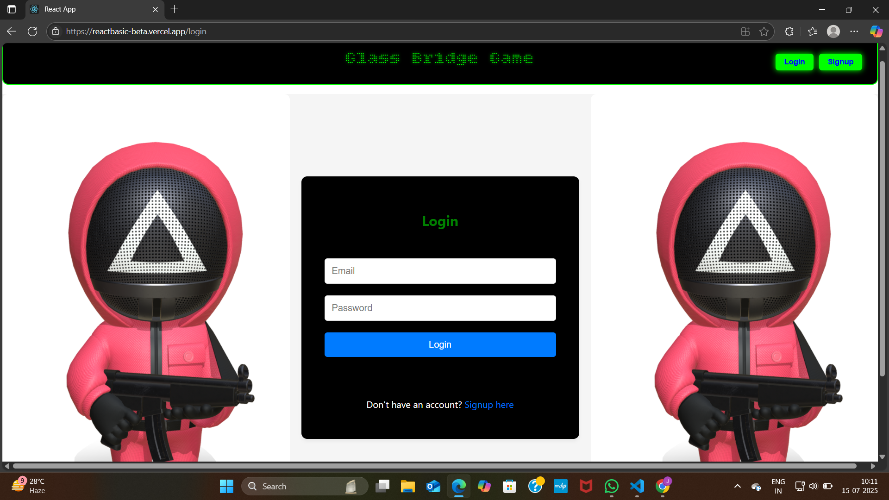
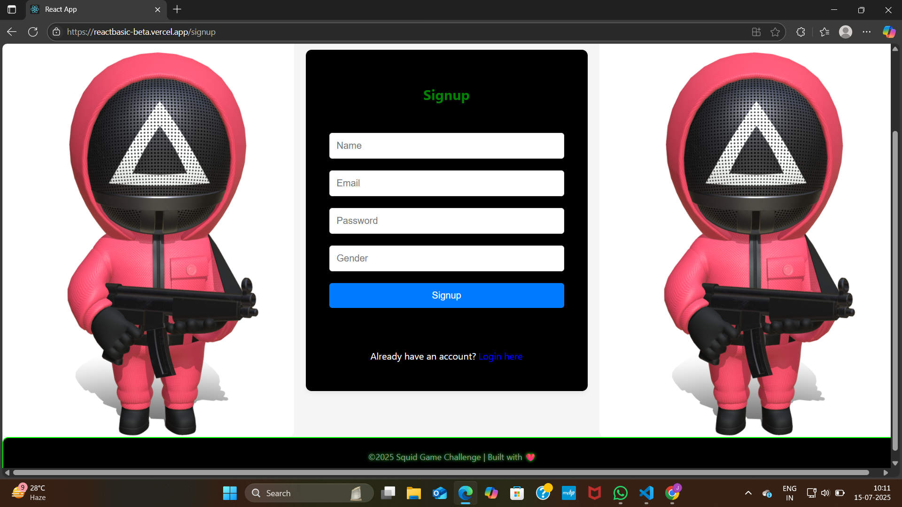

# React Basic Project

This is my first simple **React.js** project with a basic **Backend (Express.js)** setup and **MongoDB** connection.  
✅ Live Demo → [reactbasic-eight.vercel.app](https://reactbasic-eight.vercel.app/ )  
✅ GitHub → [github.com/JAYASURYA-KK/reactbasic](https://github.com/JAYASURYA-KK/reactbasic)

---

## 📸 Project Screenshots

### 🏠 Home Page


### 🔐 Login Page


### 📝 Signup Page


---

## 🛠️ Project Features

- Simple **React.js** frontend
- **Express.js** backend API setup
- **MongoDB Atlas** or **Local MongoDB** database connection
- User **Signup** and **Login** forms
- Clean UI with basic routing

---

## 📂 Project Structure

```
reactbasic/
│
├── backend/           # Express Backend API
│   ├── .env           # MongoDB Connection String
│   ├── server.js      # Main backend server file
│   └── ...other files
│
├── public/
├── src/               # React Frontend Code
│   ├── components/
│   ├── App.js
│   └── ...
│
└── screenshot/        # Project UI Screenshots
    ├── home.png
    ├── login.png
    └── signup.png
```

---

## ⚙️ Backend Setup

### 1. Navigate to backend folder:
```bash
cd backend
```

### 2. Install dependencies:
```bash
npm install
```

### 3. Create `.env` file inside `backend/` folder:
```
MONGO_URL=your_mongodb_connection_link
```
- Example for MongoDB Atlas:
```
MONGO_URL=mongodb+srv://<username>:<password>@cluster0.mongodb.net/<dbname>?retryWrites=true&w=majority
```
- Example for local MongoDB:
```
MONGO_URL=mongodb://127.0.0.1:27017/yourdatabasename
```

### 4. Start Backend Server:
```bash
node server.js
```

---

## 🚀 Frontend Setup

### 1. Install frontend dependencies:
```bash
npm install
```

### 2. Start React Frontend:
```bash
npm start
```

Your app will run on [http://localhost:3000](http://localhost:3000)

---

## 🖥️ Live Demo

Check Live Website → [https://reactbasic-eight.vercel.app/](https://reactbasic-eight.vercel.app/)

---

## ✅ Author

Created by [JAYASURYA-KK](https://github.com/JAYASURYA-KK)  
❤️ First simple React + Node.js + MongoDB project.

---

## 📌 Note

You can replace `.env` `MONGO_URL` with your own **MongoDB Atlas** or **Local MongoDB** connection string.

---